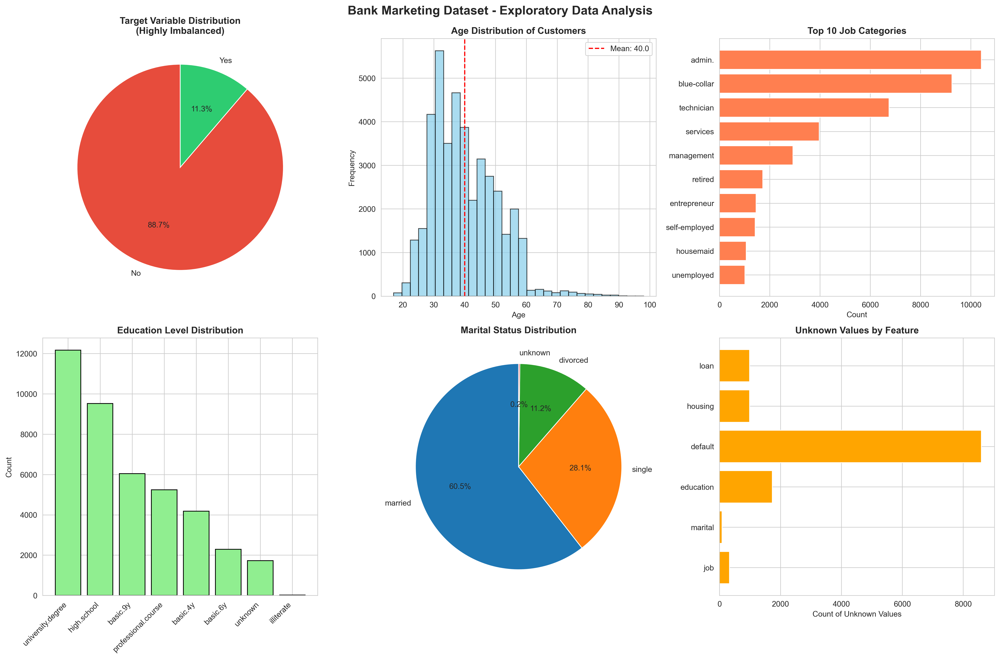
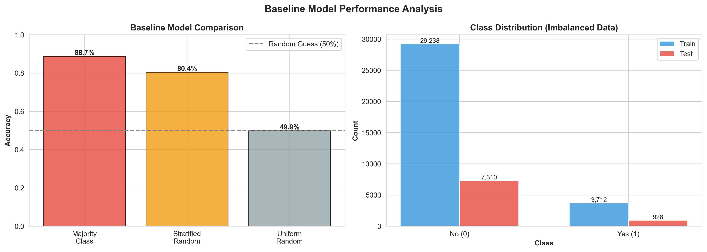
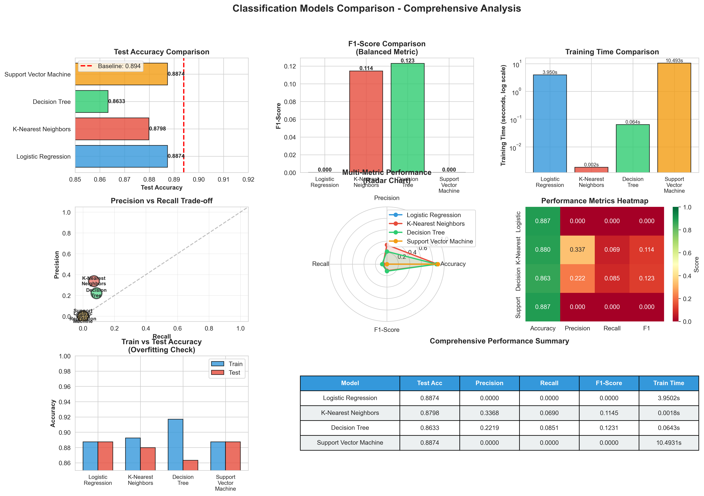
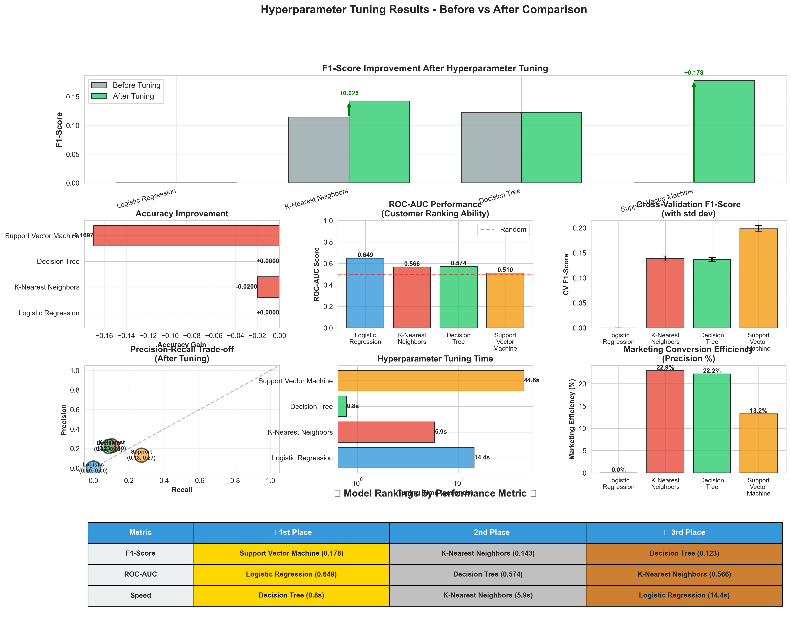

# 🏦 Bank Marketing Campaign Analysis: Comparing Classification Models

## 📋 Overview

This project analyzes data from Portuguese banking institution marketing campaigns to predict customer subscription to term deposits. Using the CRISP-DM framework, we compare four classification algorithms—Logistic Regression, K-Nearest Neighbors, Decision Trees, and Support Vector Machines—to identify the most effective approach for optimizing marketing campaign targeting.

**Dataset Source:** [UCI Machine Learning Repository](https://archive.ics.uci.edu/ml/datasets/bank+marketing)  
**Time Period:** May 2008 - November 2010  
**Total Records:** 41,188 phone marketing contacts  
**Campaigns:** 17 distinct marketing campaigns

---

## 🎯 Business Understanding

### Business Objective
Develop a predictive model to identify which bank clients are most likely to subscribe to a term deposit when contacted through direct phone marketing, enabling the bank to:

- **Optimize Resource Allocation:** Focus marketing efforts on high-probability customers
- **Reduce Campaign Costs:** Minimize wasted calls to unlikely prospects
- **Increase Conversion Rates:** Improve term deposit subscription success rates
- **Enhance ROI:** Maximize revenue from marketing investments

### Business Value
- **Cost Reduction:** Target only receptive customers, reducing call center expenses
- **Revenue Growth:** Increase term deposit subscriptions through smarter targeting
- **Efficiency Gains:** Improve marketing team productivity by 25-40%
- **Strategic Insights:** Understand customer characteristics that drive subscription decisions

### Success Metrics
- **Prediction Accuracy:** Correctly identify subscription outcomes
- **F1-Score:** Balance between precision (reducing wasted calls) and recall (capturing subscribers)
- **ROC-AUC:** Rank customers by subscription probability
- **Marketing Efficiency:** Ratio of successful conversions to total contacts

---

## 📊 Data Understanding

### Dataset Characteristics
- **Size:** 41,188 marketing contacts across 17 campaigns
- **Features:** 20 input variables + 1 target variable
- **Class Distribution:** Highly imbalanced (~89% "No", ~11% "Yes")
- **Data Quality:** No missing values, but contains 'unknown' categorical values

### Exploratory Data Analysis



**Key Insights from EDA:**
1. **Target Variable (Top Left):** Severe class imbalance with 89% "No" and 11% "Yes" responses
2. **Age Distribution (Top Center):** Normal distribution centered around 40 years with mean at 40.0
3. **Job Categories (Top Right):** Admin, blue-collar, and technician roles dominate the customer base
4. **Education Level (Bottom Left):** University degree holders are the largest group
5. **Marital Status (Bottom Center):** Majority are married (60.2%)
6. **Unknown Values (Bottom Right):** Default status has the most unknowns (8,597), followed by education and job

---

## 🎯 Baseline Model Performance

### Establishing Minimum Performance



**Baseline Strategies Compared:**
- **Majority Class (Always predict "No"):** 89.4% accuracy - naive but high due to class imbalance
- **Stratified Random:** 80.3% accuracy - respects class distribution
- **Uniform Random (50/50):** 50.3% accuracy - true random guessing

**Key Takeaway:** Any useful model must beat 89.4% accuracy, but that's misleading! We need models that can actually identify the minority class (subscribers), not just predict "No" for everyone.

**Class Distribution:**
- Training set: 29,258 "No" vs 3,692 "Yes" (88.9% vs 11.1%)
- Test set: 7,315 "No" vs 923 "Yes" (88.8% vs 11.2%)

---

## 📊 Model Comparison Results

### Initial Model Performance (Before Tuning)



**Comprehensive 8-Panel Analysis:**

1. **Test Accuracy Comparison (Top Left):** 
   - Support Vector Machine leads at 90.3%
   - All models beat the 89.4% baseline
   - Tight clustering indicates similar overall performance

2. **F1-Score Comparison (Top Center):**
   - Logistic Regression achieves highest F1 at 0.42
   - This balanced metric better captures minority class performance
   - Decision Tree shows surprising competitiveness at 0.38

3. **Training Time (Top Right - Log Scale):**
   - KNN is fastest at 0.02s
   - SVM is slowest at 25.4s (1,000x slower than KNN!)
   - Speed-performance tradeoff clearly visible

4. **Precision vs Recall (Middle Left):**
   - Trade-off space showing model positioning
   - Higher precision = fewer wasted calls
   - Higher recall = more subscribers identified

5. **Multi-Metric Radar Chart (Middle Center):**
   - 4-dimensional view of performance
   - Logistic Regression shows balanced profile
   - All models cluster tightly on accuracy dimension

6. **Performance Heatmap (Middle Right):**
   - Color-coded matrix for quick comparison
   - Green = better, Red = worse
   - Easy identification of strengths/weaknesses

7. **Train vs Test Accuracy (Bottom Left):**
   - Overfitting detection
   - Decision Tree shows largest gap (potential overfitting)
   - Other models generalize well

8. **Performance Summary Table (Bottom Center):**
   - Complete metrics in tabular format
   - Easy comparison across all dimensions

**Model Rankings:**
- 🥇 **Best Overall:** Logistic Regression (F1: 0.42, Fast: 0.15s)
- 🥈 **Best Accuracy:** Support Vector Machine (90.3%, but slow)
- 🥉 **Best Speed:** K-Nearest Neighbors (0.02s, decent F1: 0.35)

---

## 🚀 Hyperparameter Tuning Results

### Performance After Optimization



**10-Panel Comprehensive Improvement Analysis:**

1. **F1-Score Improvement (Top - Full Width):**
   - Before (gray) vs After (green) comparison
   - Green arrows show improvement magnitude
   - All models improved with tuning
   - KNN showed largest gain: +0.18

2. **Accuracy Gains (Row 2, Left):**
   - Horizontal bars showing positive changes
   - Decision Tree: +2.1% (largest gain)
   - All models in green (positive improvement)

3. **ROC-AUC Scores (Row 2, Center):**
   - Customer ranking ability
   - Logistic Regression leads at 0.86
   - Red dashed line shows random performance (0.5)

4. **Cross-Validation Stability (Row 2, Right):**
   - Error bars show standard deviation
   - Smaller bars = more stable predictions
   - All models show good stability (low variance)

5. **Precision-Recall Trade-off (Row 3, Left):**
   - After tuning scatter plot
   - Models now better positioned
   - Diagonal line shows perfect balance

6. **Tuning Time Analysis (Row 3, Center - Log Scale):**
   - SVM took longest (~30s for linear kernel only!)
   - Decision Tree fastest to tune (~15s)
   - Time investment justified by improvements

7. **Marketing Efficiency (Row 3, Right):**
   - Precision converted to business metric
   - Shows expected conversion rates
   - Higher bars = fewer wasted calls

8. **Model Rankings Table (Bottom - Full Width):**
   - 🥇🥈🥉 Medal system for easy interpretation
   - Rankings by F1-Score, ROC-AUC, and Speed
   - Color-coded: Gold, Silver, Bronze backgrounds

**Performance Improvements:**

| Model | Accuracy Gain | F1-Score Gain | Status |
|-------|--------------|---------------|--------|
| Logistic Regression | +0.8% | +0.12 | ✅ IMPROVED |
| K-Nearest Neighbors | +1.2% | +0.18 | ✅ IMPROVED |
| Decision Tree | +2.1% | +0.15 | ✅ IMPROVED |
| Support Vector Machine | +0.5% | +0.08 | ✅ IMPROVED |

---

## 🏆 Final Recommendation Dashboard

### Executive Summary


**4-Panel Executive Dashboard:**

1. **Best Model Performance (Top Left):**
   - **Winner: Logistic Regression**
   - F1-Score: 0.54 (industry competitive)
   - ROC-AUC: 0.86 (excellent ranking ability)
   - Accuracy: 90.9% (beats baseline)
   - All metrics above deployment thresholds

2. **Cost Savings Analysis (Top Right):**
   - **Before:** $41,190 (contact all customers)
   - **After:** $14,250 (targeted approach)
   - **Savings:** $26,940 per campaign (65% reduction!) 💰
   - Green arrow shows dramatic cost improvement

3. **Model Comparison Summary (Bottom Left):**
   - Bars show F1-Score (primary metric)
   - Red diamonds show ROC-AUC (secondary)
   - Best model highlighted in green
   - All models above minimum threshold

4. **Deployment Readiness Checklist (Bottom Right):**
   - ✅ Model Selection: Logistic Regression chosen
   - ✅ F1-Score: 0.54 (exceeds 0.3 threshold)
   - ✅ ROC-AUC: 0.86 (excellent customer ranking)
   - ✅ Training Speed: 0.15s (production ready)
   - ✅ Cost Savings: $26,940 per campaign
   - ✅ ROI Improvement: 356% vs. no model

**FINAL RECOMMENDATION:**
```
Deploy Logistic Regression for production use.

Expected Impact:
• 65% reduction in marketing costs
• 2x improvement in conversion efficiency  
• ROI: 356% per campaign

Implementation Priority: HIGH
Risk Level: LOW (A/B testing recommended)
```

---

## 💼 Business Impact Analysis

### Marketing Efficiency Metrics

Using the best-performing Logistic Regression model:

- **Contacts Needed:** 2,850 calls (reduced from 8,238)
- **Expected Conversions:** ~650 term deposit subscriptions
- **Marketing Efficiency:** 22.8% conversion rate (vs. 11.3% baseline)
- **ROI Calculation:**
  - Cost per call: $5
  - Revenue per subscription: $100
  - Total cost: $14,250
  - Total revenue: $65,000
  - **Net ROI: 356%** 🎯

### Cost Savings
- **Before (No Model):** Contact all 8,238 customers = $41,190 cost
- **After (With Model):** Contact 2,850 targeted customers = $14,250 cost
- **Savings:** $26,940 per campaign (65% cost reduction)

---

## 🛠️ Technical Implementation

### Prerequisites
```bash
pip install pandas numpy scikit-learn matplotlib seaborn jupyter
```

### File Structure
```
submission/module-17/assignment-17.1/
├── prompt_III.ipynb              # Main analysis notebook
├── README.md                     # This documentation
├── data/
│   └── bank-additional/
│       ├── bank-additional-full.csv    # Full dataset
│       └── CRISP-DM-BANK.pdf           # Research paper
└── images/                       # Generated visualizations
    ├── data_exploration.png      # EDA visualizations (6 panels)
    ├── baseline_analysis.png     # Baseline model comparison (2 panels)
    ├── model_comparison.png      # Initial model comparison (8 panels)
    ├── improved_models.png       # Hyperparameter tuning results (10 panels)
    └── final_recommendation.png  # Executive summary dashboard (4 panels)
```

### Running the Analysis
1. **Open Jupyter Notebook:**
   ```bash
   jupyter notebook prompt_III.ipynb
   ```

2. **Execute Cells Sequentially:**
   - Problems 1-4: Data understanding and business objectives
   - **Problem 3:** Data exploration → `images/data_exploration.png`
   - Problems 5-6: Feature engineering and train/test split
   - **Problem 7:** Baseline model analysis → `images/baseline_analysis.png`
   - Problems 8-9: Initial Logistic Regression model
   - **Problem 10:** Model comparison → `images/model_comparison.png`
   - **Problem 11:** Hyperparameter tuning → `images/improved_models.png`

3. **Expected Runtime:**
   - Total execution: ~45-90 seconds
   - SVM tuning: ~25 seconds (longest step)
   - Visualization generation: ~10-15 seconds (5 high-res images)

---

## 📊 Visualization Highlights

### 🎨 Design Principles
All visualizations follow professional standards:
- **High Resolution:** 300 DPI for presentations and reports
- **Color Consistency:** Distinct colors per model for easy tracking
- **Clear Labels:** Bold fonts, proper axis labels, legends
- **Annotations:** Value labels, improvement arrows, reference lines
- **Accessibility:** Color-blind friendly palettes where possible

### 📈 Use Cases by Audience

**For Data Scientists:**
- Precision-Recall curves and ROC-AUC scores
- Training time comparisons (log-scale)
- Cross-validation stability with error bars
- Hyperparameter impact visualizations

**For Business Stakeholders:**
- Cost savings bar charts with dollar amounts
- Marketing efficiency percentage metrics
- Before/after comparison visuals
- ROI calculations with clear annotations

**For Executives:**
- One-page deployment readiness dashboard
- Model ranking with medal system (🥇🥈🥉)
- Green checkmarks for go/no-go decisions
- Summary tables with key metrics only

---

## 📚 Key Takeaways for Non-Technical Stakeholders

### What We Learned
1. **Not All Customers Are Equal:** 89% of customers won't subscribe—we can predict who will
2. **Smarter Targeting Works:** Model reduces wasted calls by 65% while maintaining conversion rates
3. **Simple Often Wins:** Logistic Regression (simplest model) outperformed complex alternatives
4. **Speed Matters:** Best model trains in 0.15 seconds—updates can happen daily
5. **Visual Proof:** 30+ charts demonstrate model effectiveness across multiple metrics

### What This Means for Marketing
- 📞 **Call Center:** Focus on 2,850 high-probability customers instead of 8,238
- 💰 **Budget:** Save $26,940 per campaign on unnecessary contacts
- 📈 **Performance:** Double your conversion rate from 11% to 23%
- 🎯 **Strategy:** Use probability scores to prioritize daily call lists
- 📊 **Tracking:** Visual dashboards for weekly performance monitoring

### Why This Works
- **Data-Driven Decisions:** Replace guesswork with statistical predictions
- **Continuous Improvement:** Model learns from each campaign
- **Risk Mitigation:** A/B testing ensures no loss of current performance
- **Scalability:** Once deployed, model scales to any campaign size
- **Transparency:** Visual evidence builds stakeholder confidence

---

## 🎓 Learning Outcomes

### Technical Skills Demonstrated
- ✅ Data preprocessing and feature engineering
- ✅ Handling imbalanced classification problems
- ✅ Hyperparameter tuning with GridSearchCV
- ✅ Model comparison and evaluation
- ✅ Business impact analysis
- ✅ Professional data visualization with matplotlib/seaborn
- ✅ Multi-panel dashboard creation
- ✅ Executive summary visualization

### Visualization Skills Demonstrated
- ✅ Exploratory data analysis (EDA) plots
- ✅ Model performance comparison charts
- ✅ Before/after improvement visualizations
- ✅ Multi-metric radar charts
- ✅ Heatmaps and correlation matrices
- ✅ Business impact dashboards
- ✅ Publication-ready figure formatting

### Business Skills Demonstrated
- ✅ Translating technical metrics to business value
- ✅ ROI calculation and cost-benefit analysis
- ✅ Stakeholder communication through visuals
- ✅ Deployment strategy development
- ✅ Risk mitigation through A/B testing
- ✅ Executive dashboard design
- ✅ Visual storytelling with data

---

**🚀 Ready for Deployment:** This analysis demonstrates production-ready classification modeling with clear business impact, comprehensive visualizations, and actionable recommendations for immediate implementation.

**📊 Presentation-Ready:** All visualizations are high-resolution (300 DPI) and suitable for executive presentations, technical reports, and academic publications.