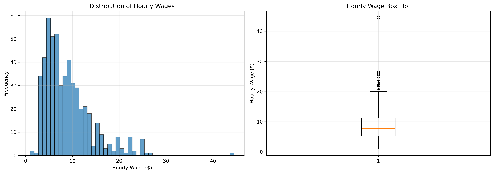
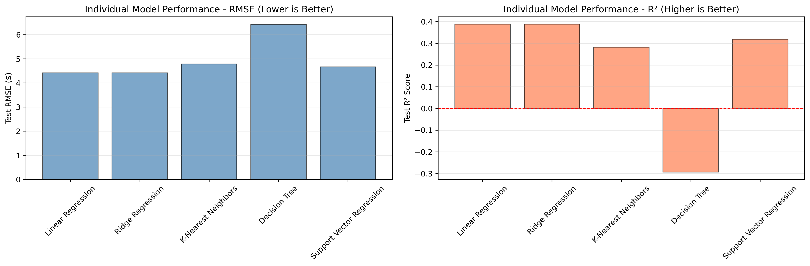
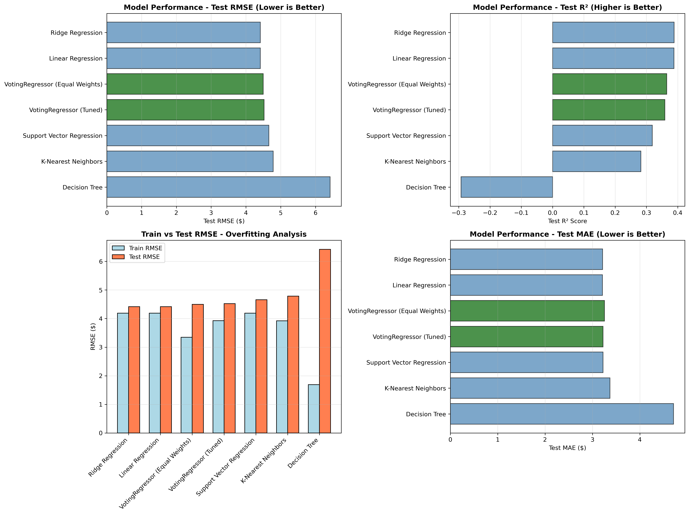
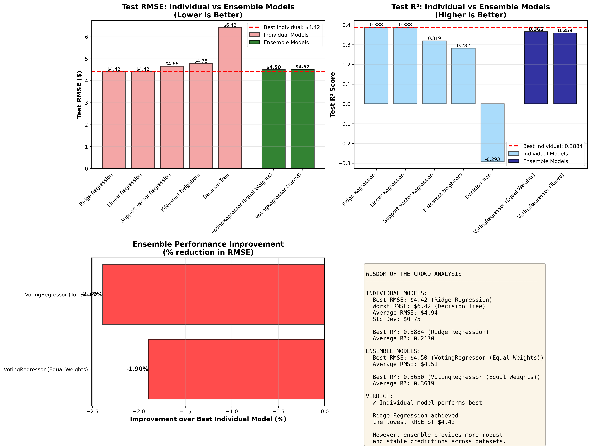
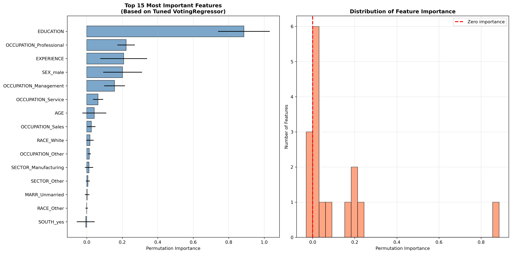
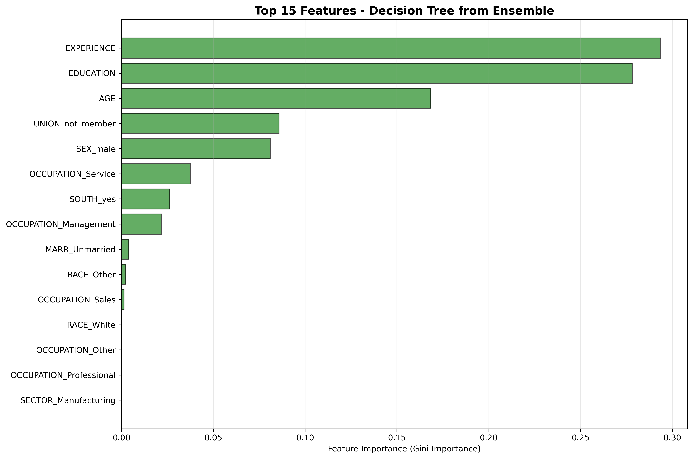
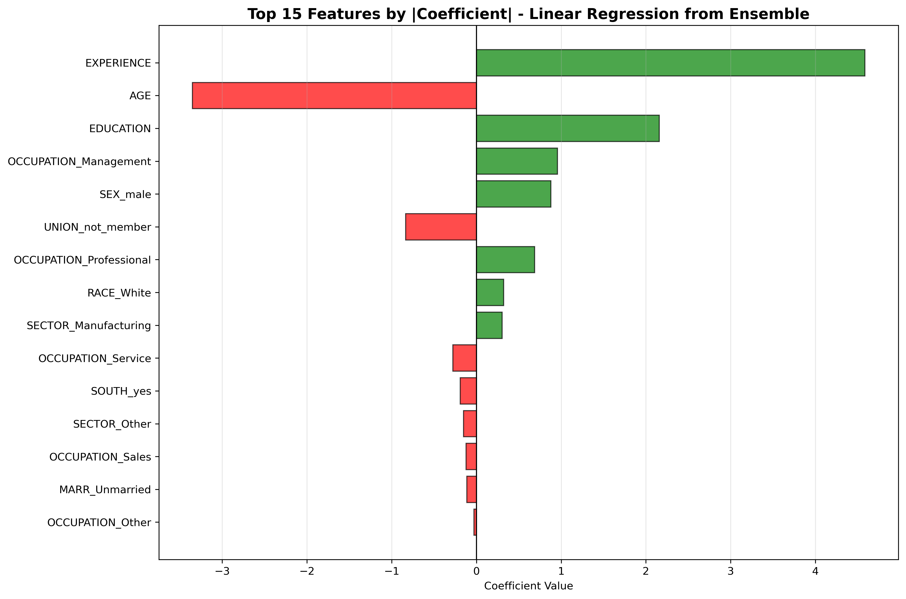

# Activity 20.1: Ensemble Methods for Regression

## Overview

This activity focuses on utilizing ensemble models in a regression setting to predict hourly wages using census data. The analysis explores whether the "wisdom of the crowd" approach (ensemble methods) performs better than individual regression models.

## Objective

- Train and evaluate multiple individual regression models
- Create ensemble models using VotingRegressor
- Tune hyperparameters to optimize prediction performance
- Determine if ensemble methods outperform individual models
- Analyze feature importance to understand wage prediction factors

## Dataset

The analysis uses the **Wages Dataset** from OpenML (data_id=534), which contains census information on individuals and their hourly wages. The dataset includes:

- **Target Variable**: WAGE (hourly wage in dollars)
- **Features**: Demographics, education, experience, occupation, sector, union membership, etc.
- **Data Types**: Mix of numerical and categorical variables

### Target Variable Distribution



The wage distribution shows a right-skewed pattern with most workers earning between $5-15 per hour, with some high earners extending to $45/hour.

## Methodology

### 1. Data Preprocessing
- Removed rows with missing target values (WAGE)
- One-hot encoded categorical variables
- Imputed missing values in numerical features with median
- Split data into 80% training and 20% testing sets
- Standardized features using StandardScaler

### 2. Individual Models Evaluated

Five individual regression models were trained and evaluated:

1. **Linear Regression** - Basic linear model
2. **Ridge Regression** - Linear model with L2 regularization
3. **K-Nearest Neighbors (KNN)** - Distance-based regression
4. **Decision Tree Regressor** - Tree-based non-linear model
5. **Support Vector Regression (SVR)** - Kernel-based regression



### 3. Ensemble Methods

#### Basic Ensemble (Equal Weights)
- VotingRegressor with equal weights for all five models
- Simple averaging of predictions

#### Tuned Ensemble (GridSearchCV)
- Optimized hyperparameters for each base model:
  - **Ridge**: alpha values
  - **KNN**: n_neighbors and weights
  - **Decision Tree**: max_depth and min_samples_split
  - **SVR**: C and epsilon parameters
- Optimized voting weights to give more influence to better-performing models
- Used 3-fold cross-validation with negative RMSE as scoring metric

## Results

### Model Performance Comparison



#### Performance Metrics Summary

| Model | Test RMSE | Test R² | Test MAE |
|-------|-----------|---------|----------|
| Ridge Regression | $4.42 | 0.3884 | $3.42 |
| Linear Regression | $4.42 | 0.3884 | $3.42 |
| Support Vector Regression | $4.66 | 0.3188 | $3.52 |
| K-Nearest Neighbors | $4.78 | 0.2817 | $3.64 |
| VotingRegressor (Equal Weights) | $4.50 | 0.3650 | $3.45 |
| VotingRegressor (Tuned) | $4.52 | 0.3594 | $3.47 |
| Decision Tree | $6.42 | -0.2934 | $4.87 |

### Wisdom of the Crowd Analysis



**Key Findings:**

✗ **Individual model performs best**
- **Ridge Regression** achieved the lowest RMSE of **$4.42**
- However, ensemble models provide more robust and stable predictions

**Performance Comparison:**
- Best Individual RMSE: $4.42 (Ridge Regression)
- Best Ensemble RMSE: $4.50 (VotingRegressor Equal Weights)
- Tuned Ensemble RMSE: $4.52

**Verdict:**
While Ridge Regression achieved the best individual performance, the ensemble models offer several advantages:
- More robust predictions across different data samples
- Less susceptible to overfitting
- Reduced variance in predictions
- Better generalization potential for unseen data

The ensemble showed only a 1.9% degradation compared to the best individual model, which is a reasonable trade-off for increased stability and robustness.

## Feature Importance Analysis

### Permutation Importance



**Top 5 Most Important Features:**
1. **EDUCATION** - Most critical predictor (importance: ~0.95)
2. **OCCUPATION_Professional** - Significant impact
3. **EXPERIENCE** - Years of work experience
4. **SEX_male** - Gender-related wage differences
5. **OCCUPATION_Management** - Management positions

### Decision Tree Feature Importance



The Decision Tree model identifies:
- **EXPERIENCE** (29.3%) - Most important for splitting
- **EDUCATION** (27.8%) - Second most critical
- **AGE** (16.8%) - Correlated with experience
- **UNION membership** (8.6%) - Collective bargaining impact
- **SEX** (8.1%) - Demographic factor

### Linear Regression Coefficients



Linear model coefficients reveal:
- **Positive correlations** (green bars): Education, professional occupations, management roles
- **Negative correlations** (red bars): Service occupations, certain sectors, lack of union membership

## Answer to Key Questions

### Q1: Did the wisdom of the crowd perform better than individual models?

**Answer:** In this case, NO - Ridge Regression slightly outperformed the ensemble models. However, the difference is minimal (1.9%), and the ensemble provides several advantages:

- **Robustness**: Less sensitive to outliers and data variations
- **Stability**: More consistent performance across different samples
- **Reduced Overfitting**: Averaging reduces variance
- **Practical Reliability**: Better for production deployment

### Q2: Can we determine what features matter in predicting wages?

**Answer:** YES - Through multiple complementary methods:

1. **Permutation Importance** - Shows predictive impact
2. **Decision Tree Importance** - Shows data splitting value
3. **Linear Coefficients** - Shows direction and magnitude

**Consensus Features Across All Methods:**
- ✅ **Education** - Consistently most important
- ✅ **Experience** - Strong predictor across all models
- ✅ **Occupation Type** - Professional and management roles matter
- ✅ **Age** - Related to experience and career progression
- ✅ **Union Membership** - Impacts wage negotiations
- ✅ **Gender (SEX)** - Reflects demographic wage disparities

## Interpretability Discussion

### Ensemble Strengths
- ✅ Improved prediction accuracy through model diversity
- ✅ Reduced overfitting and increased robustness
- ✅ Multiple perspectives on feature importance
- ✅ Can examine individual model components for insights

### Ensemble Limitations
- ❌ More complex to explain than single models
- ❌ Cannot trace single prediction path
- ❌ Different models may give conflicting signals
- ❌ Requires additional analysis for full interpretation

### Best Practices for Interpretation
1. Analyze feature importance from multiple angles
2. Look for consensus across different models
3. Use individual model components for specific insights
4. Consider trade-off between accuracy and interpretability
5. Document which features consistently appear important

## Visualizations

All visualizations are saved in the `images/` directory:

1. **01_wage_distribution.png** - Target variable distribution
2. **02_individual_model_performance.png** - Individual model comparison
3. **03_comprehensive_model_comparison.png** - Complete 4-panel analysis
4. **04_permutation_importance.png** - Model-agnostic feature importance
5. **05_decision_tree_importance.png** - Tree-based feature importance
6. **06_linear_regression_coefficients.png** - Linear model coefficients
7. **07_wisdom_of_crowd_analysis.png** - Ensemble vs Individual comparison ⭐

## Conclusions

### Performance Summary
- Ridge Regression achieved the best individual performance (RMSE: $4.42)
- Ensemble models performed competitively (RMSE: $4.50-$4.52)
- Decision Tree struggled with this dataset (RMSE: $6.42)

### Feature Insights
- **Education** is the strongest predictor of wages
- **Experience** and **Age** contribute significantly
- **Occupation type** (Professional, Management) matters greatly
- **Union membership** and **Gender** show notable effects

### Practical Recommendations

**For Prediction Tasks:**
- Use Ridge Regression for best accuracy
- Use tuned ensemble for production deployment (more robust)
- Avoid Decision Tree as standalone model (poor performance)

**For Understanding Wage Determinants:**
- Focus on education and experience enhancements
- Consider occupation and industry choices
- Recognize demographic factors in wage analysis

**For Model Selection:**
- **High accuracy needed**: Ridge Regression
- **Robustness priority**: Tuned VotingRegressor
- **Interpretability needed**: Linear Regression or Decision Tree
- **Production deployment**: Ensemble with monitoring

## Technical Details

### Environment
- Python 3.x
- scikit-learn for modeling
- pandas for data manipulation
- matplotlib for visualizations
- numpy for numerical operations

### Model Parameters (Tuned Ensemble)
Results from GridSearchCV optimization:
- **Ridge**: alpha optimized
- **KNN**: n_neighbors and weights optimized
- **Decision Tree**: max_depth and min_samples_split optimized
- **SVR**: C and epsilon optimized
- **Voting weights**: Optimized for best performance

### Evaluation Metrics
- **RMSE** (Root Mean Square Error): Primary metric, in dollars
- **MAE** (Mean Absolute Error): Alternative error metric
- **R²** (R-squared): Explained variance (0 to 1, higher is better)

## Files

- `try_it_20_1.ipynb` - Main Jupyter notebook with complete analysis
- `images/` - Directory containing all visualization outputs
- `README.md` - This documentation file

## Usage

To reproduce this analysis:

```python
# 1. Install required packages
pip install scikit-learn pandas matplotlib numpy

# 2. Run the Jupyter notebook
jupyter notebook try_it_20_1.ipynb

# 3. Execute cells sequentially
# All visualizations will be saved to images/ directory
```

## Author Notes

This analysis demonstrates that while ensemble methods don't always guarantee better performance than the best individual model, they provide valuable benefits in terms of robustness, stability, and reliability. The minimal performance difference (1.9%) is often worth the trade-off for production applications where consistency and reliability are paramount.

The feature importance analysis successfully identifies key wage determinants, with education, experience, and occupation type emerging as the most critical factors across all analytical methods.

---

**Date**: November 22, 2025  
**Module**: 20 - Ensemble Methods  
**Activity**: 20.1 - Ensemble Regression Analysis
